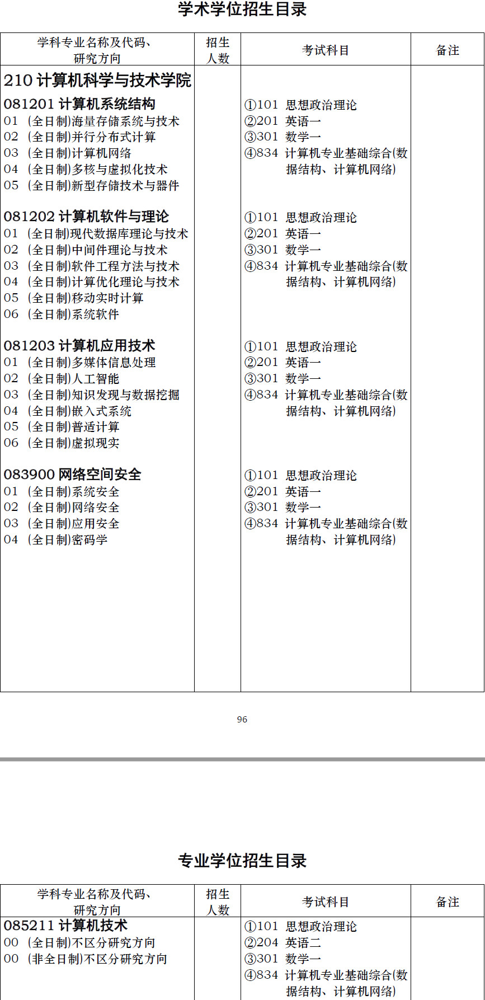
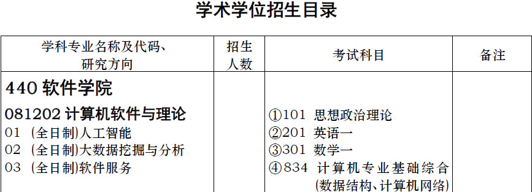
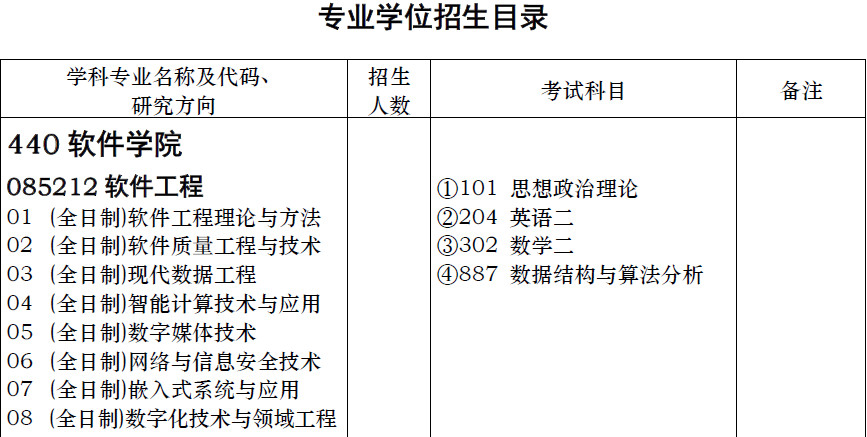
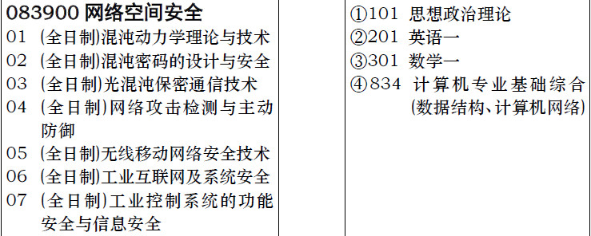
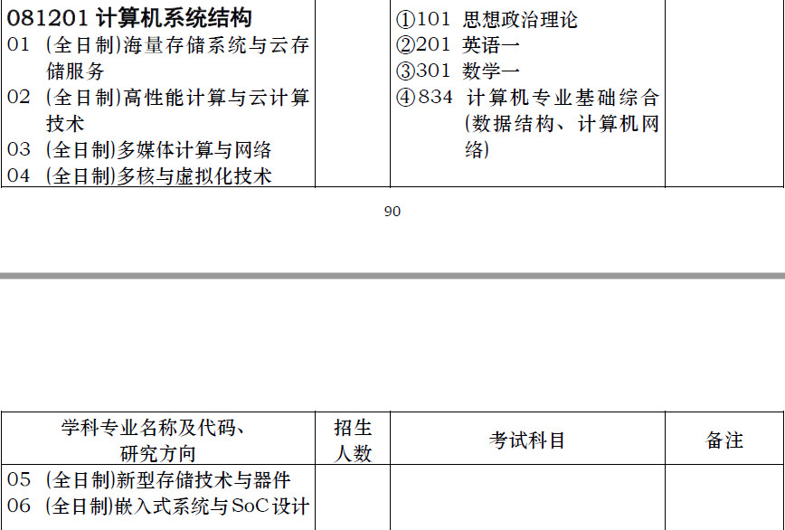
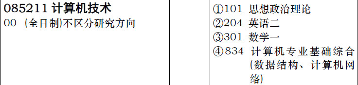

# 华中科技大学计算机考研报考资料、复试资料汇总 for 2020
>QQ交流群: 716736870

## 目录
* [初试篇](#初试篇)
   * [华科考研重要网站](#华科考研重要网站)
   * [招生专业目录](#招生专业目录)
       * [1. 计算机科学与技术学院招生目录](#1-计算机科学与技术学院招生目录)
       * [2. 软件学院招生目录](#2-软件学院招生目录)
       * [3. 自动化学院](#3-自动化学院招生目录)
       * [4. 武汉光电国家研究中心](#4-武汉光电国家研究中心招生目录)
    * [考试大纲](#考试大纲)
       * [1. 834计算机专业基础综合](#1-834计算机专业基础综合)
       * [2. 887数据结构与算法分析](#2-887数据结构与算法分析)
* [复试篇](#复试篇)
   * [分数线](#分数线)
       * [1. 分数线简介](#1-分数线简介)
       * [2. 国家线](#2-国家线)
            * [2.1 2017年国家线](#21-2017年国家线)
            * [2.2 2018年国家线](#22-2018年国家线)
            * [2.3 2019年国家线](#23-2019年国家线)
       * [3. 院线](#3-院线)
            * [3.1 计算机科学与技术学院院线](#31-计算机科学与技术学院院线)
            * [3.2 软件学院院线](#32-软件学院院线)
            * [3.3 自动化学院院线](#33-自动化学院院线)
            * [3.4 武汉光电国家研究中心院线](#34-武汉光电国家研究中心院线)
   * [复试进行时](#复试进行时)
       * [1. 复试细则](#1-复试细则)
            * [1.1 计算机科学与技术学院复试细则](#11-计算机科学与技术学院复试细则)
            * [1.2 软件学院复试细则](#12-软件学院复试细则)
            * [1.3 自动化学院复试细则](#13-自动化学院复试细则)
            * [1.4 武汉光电国家研究中心复试细则](#14-武汉光电国家研究中心复试细则)
       * [2. 复试名单](#2-复试名单)
            * [2.1 计算机科学与技术学院复试名单](#21-计算机科学与技术学院复试名单)
            * [2.2 软件学院复试名单](#22-软件学院复试名单)
            * [2.3 自动化学院复试名单](#23-自动化学院复试名单)
            * [2.4 武汉光电国家研究中心复试名单](#24-武汉光电国家研究中心复试名单)
       * [3. 复试科目](#3-复试科目)
            * [3.1 计算机科学与技术学院复试科目](#31-计算机科学与技术学院复试科目)
            * [3.2 软件学院复试科目](#32-软件学院复试科目)
            * [3.3 自动化学院复试科目](#33-自动化学院复试科目)
            * [3.4 武汉光电国家研究中心复试科目](#34-武汉光电国家研究中心复试科目)
       * [4. 导师资料](#4-导师资料)
       * [5. 王道经验贴](#5-王道经验贴)

## 初试篇
### 华科考研重要网站
- [王道论坛](http://cskaoyan.com/forum.php?mod=forumdisplay&fid=306&filter=typeid&typeid=48)
- [华中科技大学研招网](http://gszs.hust.edu.cn/)
- [计算机科学与技术学院](http://www.cs.hust.edu.cn/)
- [软件学院](http://sse.hust.edu.cn/)
- [自动化学院](http://aia.hust.edu.cn/)
- [武汉光电国家研究中心](http://www.wnlo.cn)

### 招生专业目录
#### 1. 计算机科学与技术学院招生目录

#### 2. 软件学院招生目录

#### 3. 自动化学院招生目录

#### 4. 武汉光电国家研究中心招生目录

### 考试大纲
#### 1. 834计算机专业基础综合
[834计算机专业基础综合考试大纲](./华中科技大学/初试/834计算机专业基础综合.doc)

#### 2. 887数据结构与算法分析
[887数据结构与算法分析](./华中科技大学/初试/887数据结构与算法分析.doc)

## 复试篇
### 分数线
#### 1. 分数线简介

#### 2. 国家线
##### 2.1 2017年国家线
[2017年国家线](https://yz.chsi.com.cn/kyzx/kydt/201703/20170315/1591016940.html)

##### 2.2 2018年国家线
[2018年国家线学术学位](https://yz.chsi.com.cn/kyzx/kp/201803/20180316/1670298651.html)

[2018年国家线专业学位](https://yz.chsi.com.cn/kyzx/kp/201803/20180316/1670298653.html)

##### 2.3 2019年国家线
[2019年国家线学术学位](https://yz.chsi.com.cn/kyzx/kp/201903/20190315/1772265280.html)

[2019年国家线专业学位](https://yz.chsi.com.cn/kyzx/kp/201903/20190315/1772265285.html)

#### 3. 院线
##### 3.1 计算机科学与技术学院院线

|  年份  |                专业                 |   政治   |   外语   |    数学    |    专业课   |  总分 |
| :--: | :----------------------------------: | :-----: | :------: | :-------: | :--------: |-----: |
| 2019 |         计算机科学与技术(0812)         |    55   |    50    |    95     |    100     |  350  |
| 2019 |         网络空间安全(083900)           |    55   |    50    |    95     |    100     |  340  |
| 2019 |         计算机技术(085211)             |    55   |    55    |    95     |    100     |  360  |

|  年份  |                专业                 |   政治   |   外语   |    数学    |    专业课   |  总分 |
| :--: | :----------------------------------: | :-----: | :------: | :-------: | :--------: |-----: |
| 2018 |                 工学(08)              |    50   |    50    |    85     |     90     |  345  |
| 2018 |              工程硕士(0852)           |    50   |    50    |    85     |     90     |  345  |

##### 3.2 软件学院院线

|  年份  |                专业                 |   政治   |   外语   |    数学    |    专业课   |  总分 |
| :--: | :----------------------------------: | :-----: | :------: | :-------: | :--------: |-----: |
| 2019 |       计算机软件与理论(081202)         |    55   |    50    |    95     |     100     |  345  |
| 2019 |            软件工程(085212)           |    60   |    60    |    90     |      90     |  360  |

|  年份  |                专业                 |   政治   |   外语   |    数学    |    专业课   |  总分 |
| :--: | :----------------------------------: | :-----: | :------: | :-------: | :--------: |-----: |
| 2018 |            软件工程(085212)           |    55   |    55    |    90     |       90     |  340  |

##### 3.3 自动化学院院线

|  年份  |                专业                 |   政治   |   外语   |    数学    |    专业课   |  总分 |
| :--: | :----------------------------------: | :-----: | :------: | :-------: | :--------: |-----: |
| 2019 |         网络安全空间(083900)          |    55   |    55    |    90     |     90     |  360  |

##### 3.4 武汉光电国家研究中心院线

|  年份  |                专业                 |   政治   |   外语   |    数学    |    专业课   |  总分 |
| :--: | :----------------------------------: | :-----: | :------: | :-------: | :--------: |-----: |
| 2019 |        计算机系统结构(081201)         |    55   |    55    |    90     |     100     |  350  |
| 2019 |           计算机技术(085211)          |    50   |    50    |    90     |     90     |  360  |

|  年份  |                专业                 |   政治   |   外语   |    数学    |    专业课   |  总分 |
| :--: | :----------------------------------: | :-----: | :------: | :-------: | :--------: |-----: |
| 2018 |        计算机系统结构(081201)         |    50   |    50    |     85     |      90     |  345  |
| 2018 |           计算机技术(085211)          |    50   |    50    |     85     |     90     |  345  |

### 复试进行时
#### 1 复试细则
##### 1.1 计算机科学与技术学院复试细则
[计算机科学与技术学院复试细则](./华中科技大学/复试/计院/210-计算机学院2019年硕士研究生复试工作细则.pdf)

##### 1.2 软件学院复试细则
[软件学院复试细则](./华中科技大学/复试/软院/440-软件学院2019年硕士研究生复试工作细则.pdf)

##### 1.3 自动化学院复试细则
[自动化学院复试细则](./华中科技大学/复试/自动化/184-人工智能与自动化学院2019年硕士研究生复试工作细则.pdf)

##### 1.4 武汉光电国家研究中心复试细则
[武汉光电国家研究中心复试细则](./华中科技大学/复试/光电所/187-武汉国家光电中心2019年硕士研究生复试工作细则.pdf)

#### 2 复试名单
##### 2.1 计算机科学与技术学院复试名单
[计算机学院2019年硕士研究生复试上线名单](./华中科技大学/复试/计院/计算机学院2019年硕士研究生复试上线名单.pdf)

##### 2.2 软件学院复试名单
[软件学院2018年硕士生复试名单](./华中科技大学/复试/软院/软件学院2018级硕士生复试名单.pdf)

##### 2.3 自动化学院复试名单
[2019年人工智能与自动化学院系硕士研究生复试名单](./华中科技大学/复试/自动化/2019年人工智能与自动化学院系硕士研究生复试名单.docx)

##### 2.4 武汉光电国家研究中心复试名单
[武汉国家光电中心2019年硕士研究生复试工作细则](./华中科技大学/复试/光电所/187-武汉国家光电中心2019年硕士研究生复试工作细则.pdf)

#### 3 复试科目
##### 3.1 计算机科学与技术学院复试科目

笔试：
1. 笔试科目是计算机系统结构、汇编语言程序设计、数据库系统原理、算法设计与分析四门课程中任选两门
2. 参考书：
《计算机系统结构教程》，张晨曦等，清华大学出版社，2009
《80X86汇编语言程序设计》 王元珍、曹忠升、韩宗芬、华中科技大学出版社
《数据库系统概论》 第三版，萨师煊、王珊，高等教育出版社
《计算机算法基础》 第三版，余祥宣、崔国华、邹海明，华中科技大学出版社

计算机操作能力考核：
使用CodeBlocksC或Dev环境下用C或C++编程

外语测试：
1. 听说

面试：
1. 综合面试

##### 3.2 软件学院复试科目
* 软件工程
1. 外语听力测试
主要考核考生把握英语听力材料和专业文献的主要内容、正确理解作者观点、准确回答相关问题的能力

2. 专业笔试
主要考核考生掌握《C 语言程序设计》、《数据结构》、《数据库原理》、《操
作系统》、《软件工程》等相关知识的情况。

3. 综合面试
1)政治思想品德面试，全面考核考生的政治态度、思想表现、道德品质等；着
重考察考生对一些重大政治事件的看法和认识，并对考生专业思想和治学态度等进
行必要的考察。

2)专业面试
主要考察考生的知识体系、专业素质和学习能力，了解考生对软件工程相关知
识与专业发展方向的认识程度和掌握情况。

3)英语表达
主要考察考生用英语表达自己的观点和态度的能力。

* 计算机软件与理论专业
（1） 外语听力测试
主要考核考生把握英语听力材料和专业文献的主要内容、正确理解作者观点、
准确回答相关问题的能力。

（2） 专业笔试
主要考核考生掌握《C 语言程序设计》、《数据结构》、《数据库原理》、《操
作系统》、《软件工程》等相关知识的情况。

（3）上机考核
主要考核考生掌握《C 语言程序设计》、《数据结构》等相关知识的应用情况。

（4）综合面试

1)政治思想品德面试，全面考核考生的政治态度、思想表现、道德品质等；着
重考察考生对一些重大政治事件的看法和认识，并对考生专业思想和治学态度等进
行必要的考察。

2)专业面试
主要考察考生的学术修养、综合素质和研究能力，了解考生对软件理论与技术
领域及本专业发展方向的认识程度和掌握情况。

3)英语表达
主要考察考生用英语表达自己的观点和态度的能力。

##### 3.3 自动化学院复试科目
1. 复试由专业笔试、专业面试、英语听说测试组成。考生专业面试和英语口语测试
分8 个小组进行，其中全日制学术学位2 个小组，其他6 个小组。
2. 专业笔试为专业综合考试，专业笔试考题分二组。复试专业笔试科目：第一组为
微机原理，电路理论，数字电路和其他综合（如计算机C 语言）；第二组为数据结构、管
理信息系统、数据库和其他综合（如计算机C 语言）。考生可任选两组中的一组笔试。
3. 英语听力测试统一安排在复试专业笔试前进行，根据听到的材料作答。英语口语
测试分8 个小组按学校规定执行。
英语口语测试分两个部分：

（1）考生背景介绍和问答，

（2）阅读一篇短文，复述短文内容并讨论。

##### 3.4 武汉光电国家研究中心复试科目
1. 笔试
参加本研究中心复试的考生，请从以下五门课程中任一门参加笔试。

（1） 光纤光学：《光纤光学》，刘德明，科学出版社（2016）；

（2） 激光技术：《激光技术》，兰信矩，第三版，科学出版社
（2019）；

（3） C 程序设计：谭浩强《C 程序设计（第四版）》，清华大学出版社
（2010）。

（4） 半导体物理学：《半导体物理学（第七版）》刘恩科，朱秉升、罗
晋生编著，电子工业出版社（2011）；

（5） 材料成型技术基础：《材料成形工艺》，夏巨谌、张启勋，机械工
业出版社（2010）

2. 英语与专业面试时间

#### 4 导师资料
* [计算机科学与技术学院](http://www.cs.hust.edu.cn/szdw/szll.htm)
* [软件学院](http://www.cs.hust.edu.cn/szdw/szll.htm)
* [自动化学院](http://aia.hust.edu.cn/szdw/xysz.htm)
* [武汉光电国家研究中心](http://www.wnlo.cn/index.php?id=szdw)

#### 5 王道经验贴
* [2019二战跨考上岸华科计算机学硕初复试经验贴](http://cskaoyan.com/forum.php?mod=viewthread&tid=653940&fromuid=484376)
* [2019年华中科技大学计算机考研经验](http://cskaoyan.com/forum.php?mod=viewthread&tid=654627&fromuid=484376)
* [华科计算机19年专硕全日制考研经验](http://cskaoyan.com/forum.php?mod=viewthread&tid=653993&fromuid=484376)
* [2019年华科计算机专硕跨考上岸经验总结](http://cskaoyan.com/forum.php?mod=viewthread&tid=654342&fromuid=484376)
* [I could be the one -- 2019华科计算机学硕第6经验分享](http://cskaoyan.com/forum.php?mod=viewthread&tid=654052&fromuid=484376)
* [2019华科考研初复试心得及复试真题回忆](http://cskaoyan.com/forum.php?mod=viewthread&tid=654244&fromuid=484376)
* [2019华科考研经验贴（回馈版）](http://cskaoyan.com/forum.php?mod=viewthread&tid=653904&fromuid=484376)