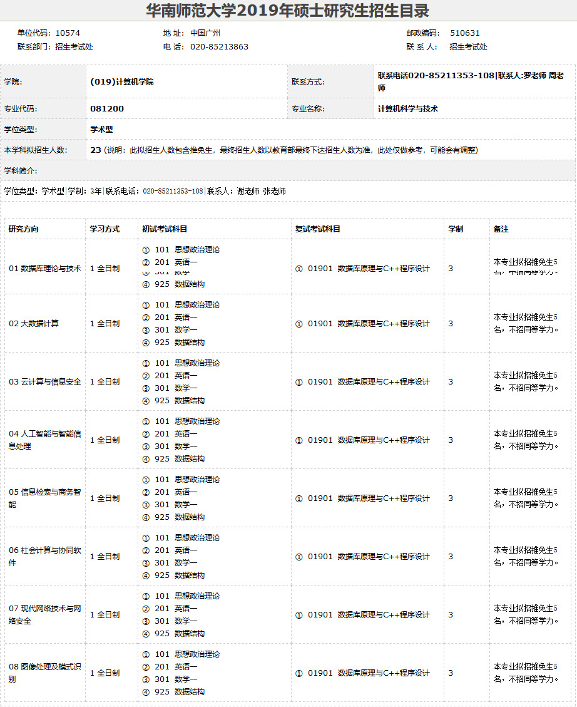
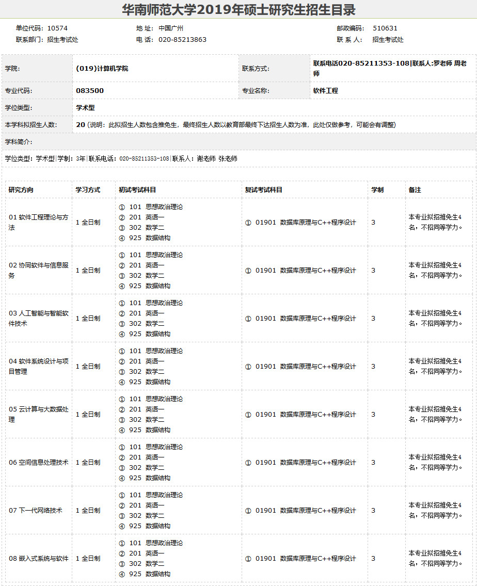
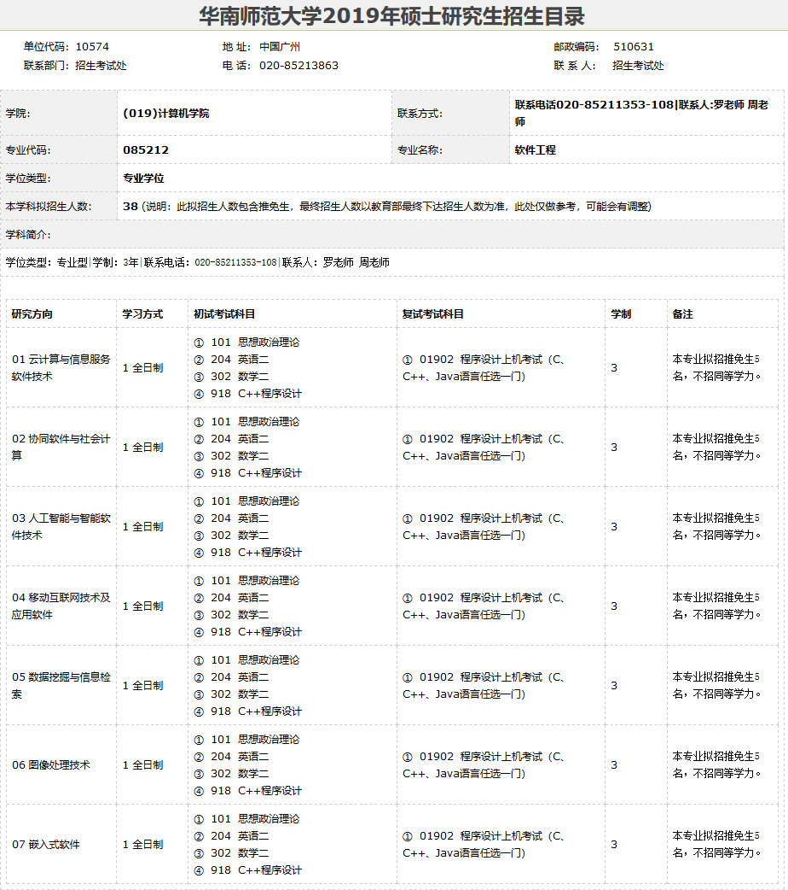
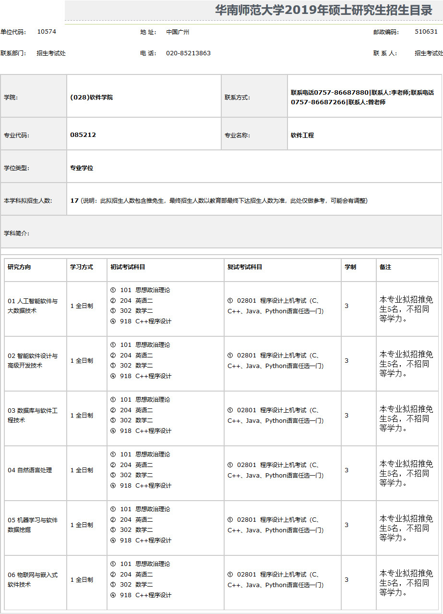
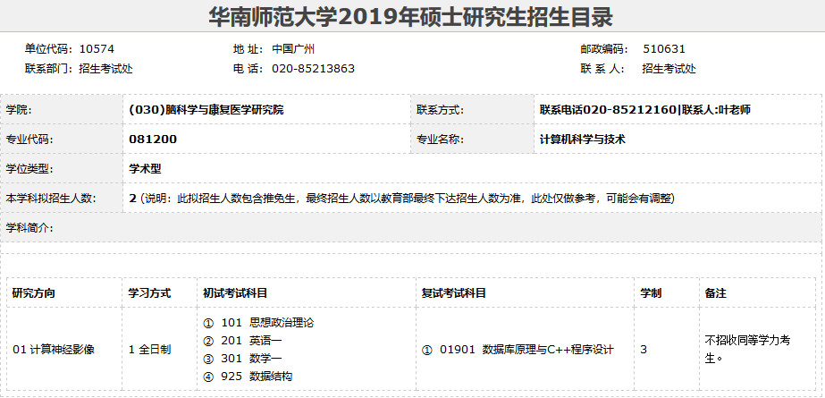
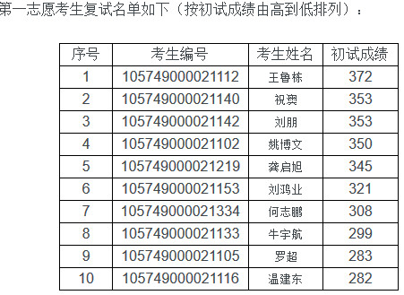
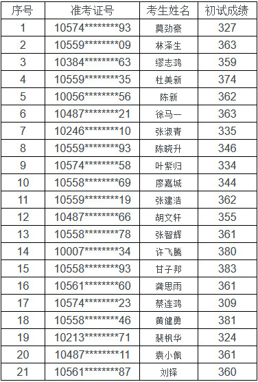
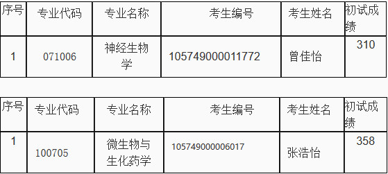

# 华南师范大学计算机考研报考资料、复试资料汇总 for 2020
>QQ交流群: 414082270

## 目录
* [初试篇](#初试篇)
   * [华南师范大学考研重要网站](#华南师范大学考研重要网站)
   * [招生专业目录](#招生专业目录)
       * [1. 计算机学院招生目录](#1-计算机学院招生目录)
       * [2. 软件学院招生目录](#2-软件学院招生目录)
       * [3. 脑科学与康复医学研究院](#3-脑科学与康复医学研究院)
    * [考试大纲](#考试大纲)
       * [1. 925数据结构](#1-925数据结构)
       * [2. 918C++程序设计](#2-918C++程序设计)
* [复试篇](#复试篇)
   * [分数线](#分数线)
       * [1. 分数线简介](#1-分数线简介)
       * [2. 国家线](#2-国家线)
            * [2.1 2017年国家线](#21-2017年国家线)
            * [2.2 2018年国家线](#22-2018年国家线)
            * [2.3 2019年国家线](#23-2019年国家线)
       * [3. 院线](#3-院线)
            * [3.1 计算机学院院线](#31-计算机学院院线)
            * [3.2 软件学院院线](#32-软件学院院线)
            * [3.3 脑科学与康复医学研究院](#33-脑科学与康复医学研究院)
   * [复试进行时](#复试进行时)
       * [1. 复试细则](#1-复试细则)
            * [1.1 计算机学院复试细则](#11-计算机学院复试细则)
            * [1.2 软件学院复试细则](#12-软件学院复试细则)
            * [1.3 脑科学与康复医学研究院](#13-脑科学与康复医学研究院)
       * [2. 复试科目](#2-复试科目)
       * [3. 复试名单](#3-复试名单)
            * [3.1 计算机学院复试名单](#31-计算机学院复试名单)
            * [3.2 软件学院复试名单](#32-软件学院复试名单)
            * [3.3 脑科学与康复医学研究院](#33-脑科学与康复医学研究院)
       * [4. 调剂信息](#4-调剂信息)
       * [5. 王道经验贴](#5-王道经验贴)

## 初试篇
### 华南师范大学考研重要网站
- [王道论坛](http://www.cskaoyan.com/forum.php?mod=forumdisplay&fid=307&filter=typeid&typeid=50)
- [华南师范大学研招网](http://yz.scnu.edu.cn)
- [计算机学院](http://cs.scnu.edu.cn/)
- [软件学院](http://ss.scnu.edu.cn/)
- [脑科学与康复医学研究院](http://ibrr.scnu.edu.cn/)

### 招生专业目录
#### 1. 计算机学院招生目录

#### 2. 软件学院招生目录

#### 3. 脑科学与康复医学研究院

### 考试大纲
#### 1. 925数据结构
[925数据结构](./华南师范大学/初试/925数据结构大纲.docx)

#### 2. 918C++程序设计
[918C++程序设计](./华南师范大学/初试/918C++程序设计.docx)

## 复试篇
### 分数线
#### 1. 分数线简介

#### 2. 国家线
##### 2.1 2017年国家线
[2017年国家线](https://yz.chsi.com.cn/kyzx/kydt/201703/20170315/1591016940.html)

##### 2.2 2018年国家线
[2018年国家线学术学位](https://yz.chsi.com.cn/kyzx/kp/201803/20180316/1670298651.html)

[2018年国家线专业学位](https://yz.chsi.com.cn/kyzx/kp/201803/20180316/1670298653.html)

##### 2.3 2019年国家线
[2019年国家线学术学位](https://yz.chsi.com.cn/kyzx/kp/201903/20190315/1772265280.html)

[2019年国家线专业学位](https://yz.chsi.com.cn/kyzx/kp/201903/20190315/1772265285.html)

#### 3. 院线
##### 3.1 计算机学院院线
参照国家线

##### 3.2 软件学院院线
参照国家线

##### 3.3 脑科学与康复医学研究院
参照国家线

### 复试进行时
#### 1 复试细则
##### 1.1 计算机学院复试细则
[2019年计算机学院复试细则](http://cs.scnu.edu.cn/a/20180322/3486.html)

##### 1.2 软件学院复试细则
[2019年软件学院复试细则](http://ss.scnu.edu.cn/a/20190324/1689.html)

##### 1.3 脑科学与康复医学研究院
[2019年脑科学与康复医学研究院](http://ibrr.scnu.edu.cn/a/20190325/177.html)

#### 2 复试科目
##### 计算机学院
* 笔试：
1.  学硕: 数据库原理与C++程序设计
2. 专硕: 程序设计上机考试（C、C++、Java任选一门）

* 综合素质考核：
1. 外语考核
2. 专业素质考核
3. 品德与实践能力考核

* 体格检查

##### 软件学院
* 专业机试：
1. 专硕：程序设计上机考试（C，C++，Java，Python语言任选一门）

* 综合素质考核：
1. 外语考核
2. 专业素质考核
3. 品德与实践能力考核

* 体格考核

##### 脑科学与康复医学研究院
* 专业笔试：
1. 数据库原理与C++程序设计

* 综合素质考核：
1. 外语考核
2. 专业素质考核
3. 品德与实践能力考核

* 体格考核

#### 3 复试名单
##### 3.1 计算机学院复试名单
1. 一志愿

##### 3.2 软件学院复试名单
1. 一志愿名单：

2. 调剂名单：

##### 3.3 脑科学与康复医学研究院
1. 一志愿名单：

2. 调剂名单：

#### 4 调剂信息
* [脑科学与康复医学研究生院](http://ibrr.scnu.edu.cn/a/20190325/174.html)

#### 5 王道经验贴
* [华南师大19软学总分第一经验贴](http://www.cskaoyan.com/forum.php?mod=viewthread&tid=654791&fromuid=484376)
* [经验贴|19华师软工专硕，初试415，二本成功逆袭211](http://www.cskaoyan.com/forum.php?mod=viewthread&tid=654699&fromuid=484376)
* [2019年华南师范大学软件工程学硕考研经历](http://www.cskaoyan.com/forum.php?mod=viewthread&tid=654703&fromuid=484376)
* [2019年华南师范大学软件工程专硕经验贴](http://www.cskaoyan.com/forum.php?mod=viewthread&tid=654674&fromuid=484376)
* [19华师计科学硕经验谈](http://www.cskaoyan.com/forum.php?mod=viewthread&tid=654457&fromuid=484376)
* [【2018华南师大】计科学硕畅师兄二战经验谈](http://www.cskaoyan.com/forum.php?mod=viewthread&tid=650130&fromuid=484376)
* [2018华南师范大学大学机试复试](http://www.cskaoyan.com/forum.php?mod=viewthread&tid=649632&fromuid=484376)