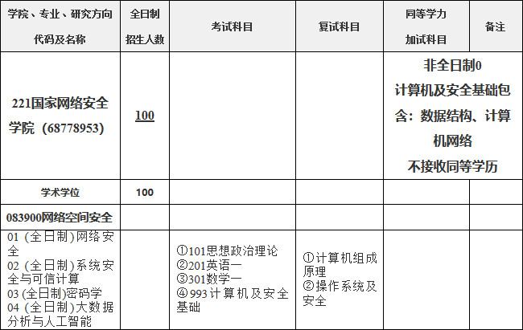
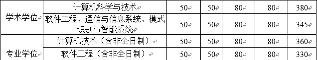
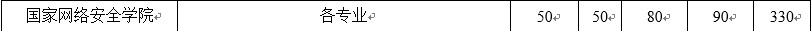

# 武汉大学计算机考研报考资料、复试资料汇总 for 2020
>QQ交流群: 274025579

## 目录
* [初试篇](#初试篇)
   * [武大考研重要网站](#武大考研重要网站)
   * [招生专业目录](#招生专业目录)
       * [1. 计算机学院招生目录](#1-计算机学院招生目录)
       * [2. 国家网络安全学院招生目录](#2-国家网络安全学院招生目录)
    * [考试大纲](#考试大纲)
       * [1. 933计算机基础](#1-933计算机基础)
       * [2. 932软件工程基础](#2-932软件工程基础)
       * [3. 993计算机及安全基础](#3-993计算机及安全基础)
* [复试篇](#复试篇)
   * [分数线](#分数线)
       * [1. 分数线简介](#1-分数线简介)
       * [2. 国家线](#2-国家线)
            * [2.1 2017年国家线](#21-2017年国家线)
            * [2.2 2018年国家线](#22-2018年国家线)
            * [2.3 2019年国家线](#23-2019年国家线)
       * [3. 院线](#3-院线)
            * [3.1 计算机学院院线](#31-计算机学院院线)
            * [3.2 国家网络安全学院院线](#32-国家网络安全学院院线)
   * [复试进行时](#复试进行时)
       * [1. 复试细则](#1-复试细则)
            * [1.1 计算机学院复试细则](#11-计算机学院复试细则)
            * [1.2 国家网络安全学院复试细则](#12-国家网络安全学院复试细则)
       * [2. 复试名单](#2-复试名单)
            * [2.1 计算机学院复试名单](#21-计算机学院复试名单)
            * [2.2 国家网络安全学院复试名单](#22-国家网络安全学院复试名单)
       * [3. 复试科目](#3-复试科目)
            * [3.1 计算机学院复试科目](#31-计算机学院复试科目)
            * [3.2 国家网络安全学院复试科目](#32-国家网络安全学院复试科目)
       * [4. 导师资料](#4-导师资料)
       * [5. 王道经验贴](#5-王道经验贴)

## 初试篇
### 武大考研重要网站
- [王道论坛](http://www.cskaoyan.com/forum-103-1.html)
- [武汉大学研招网](http://210.42.121.116/wdyz/)
- [计算机学院](http://cs.whu.edu.cn/)
- [国家网络安全学院](http://cse.whu.edu.cn/)

### 招生专业目录
#### 1. 计算机学院招生目录

#### 2. 国家网络安全学院招生目录

### 考试大纲
#### 1. 933计算机基础

#### 2. 932软件工程基础

#### 3. 993计算机及安全基础 

## 复试篇
### 分数线
#### 1. 分数线简介

#### 2. 国家线
##### 2.1 2017年国家线
[2017年国家线](https://yz.chsi.com.cn/kyzx/kydt/201703/20170315/1591016940.html)

##### 2.2 2018年国家线
[2018年国家线学术学位](https://yz.chsi.com.cn/kyzx/kp/201803/20180316/1670298651.html)

[2018年国家线专业学位](https://yz.chsi.com.cn/kyzx/kp/201803/20180316/1670298653.html)

##### 2.3 2019年国家线
[2019年国家线学术学位](https://yz.chsi.com.cn/kyzx/kp/201903/20190315/1772265280.html)

[2019年国家线专业学位](https://yz.chsi.com.cn/kyzx/kp/201903/20190315/1772265285.html)

#### 3. 院线
##### 3.1 计算机学院院线

##### 3.2 国家网络安全学院院线

### 复试进行时
#### 1 复试细则
##### 1.1 计算机学院复试细则
[计算机学院复试细则](./武汉大学/复试/计算机学院2019年硕士研究生复试录取工作细则.pdf)

##### 1.2 国家网络安全学院复试细则
[国家网络安全学院复试细则](./武汉大学/复试/国家网络安全学院2019年硕士研究生复试录取工作细则.pdf)

#### 2 复试名单
##### 2.1 计算机学院复试名单

##### 2.2 国家网络安全学院复试名单

#### 3 复试科目
##### 3.1 计算机学院复试科目

1. 计算机科学与技术

笔试：
* 数据库原理
* 英语听力

面试：
* 专业综合
* 英语口语

2. 软件工程学硕

笔试：
* 数据库原理
* 英语听力

面试：
* 专业综合
* 英语口语

3. 计算机技术（专硕）

笔试：
* 编程能力测试（上机）
* 英语听力

面试:
* 专业综合
* 英语口语

4. 软件工程 （专硕）

笔试：
* 编程能力测试（上机）
* 英语听力

面试：
* 专业综合
* 英语口语

##### 3.2 国家网络安全学院复试科目
1. 网络空间安全

笔试：
* 计算机组成原理和操作系统及安全
* 英语听力

面试：
* 专业综合
* 英语口语

#### 4 导师资料
* [计算机学院导师](http://cs.whu.edu.cn/teacher.aspx?showtype=jobtitle&typename=%e6%95%99%e6%8e%88)
* [国家网络安全学院导师](http://cse.whu.edu.cn/index.php?s=/home/szdw/azchf.html)

#### 5 王道经验贴
* [武汉大学考研经验贴集合](http://www.cskaoyan.com/thread-655019-1-1.html)