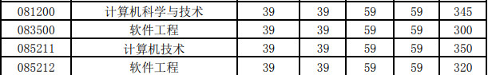

# 武汉理工大学计算机考研报考资料、复试资料汇总 for 2020
>QQ交流群: 578599463

## 目录
* [初试篇](#初试篇)
   * [武汉理工考研重要网站](#武汉理工考研重要网站)
   * [招生专业目录](#招生专业目录)
       * [1. 计算机科学与技术学院招生目录](#1-计算机科学与技术学院招生目录)
       * [2. 威尔士三一圣大卫大学招生目录](#2-威尔士三一圣大卫大学招生目录)
    * [考试大纲](#考试大纲)
       * [1. 408计算机学科专业基础综合](#1-408计算机学科专业基础综合)
       * [2. 852数据结构](#2-852数据结构)
* [复试篇](#复试篇)
   * [分数线](#分数线)
       * [1. 分数线简介](#1-分数线简介)
       * [2. 国家线](#2-国家线)
            * [2.1 2017年国家线](#21-2017年国家线)
            * [2.2 2018年国家线](#22-2018年国家线)
            * [2.3 2019年国家线](#23-2019年国家线)
       * [3. 院线](#3-院线)
            * [3.1 计算机科学与技术学院院线](#31-计算机科学与技术学院院线)
            * [3.2 威尔士三一圣大卫大学院线](#32-威尔士三一圣大卫大学院线)
   * [复试进行时](#复试进行时)
       * [1. 复试细则](#1-复试细则)
            * [1.1 计算机科学与技术学院复试细则](#11-计算机科学与技术学院复试细则)
            * [1.2 威尔士三一圣大卫大学学院复试细则](#12-威尔士三一圣大卫大学学院复试细则)
       * [2. 复试名单](#2-复试名单)
            * [2.1 计算机科学与技术学院复试名单](#21-计算机科学与技术学院复试名单)
            * [2.2 威尔士三一圣大卫大学学院复试名单](#22-威尔士三一圣大卫大学学院复试名单)
       * [3. 复试科目](#3-复试科目)
            * [3.1 计算机科学与技术学院复试科目](#31-计算机科学与技术学院复试科目)
            * [3.2 威尔士三一圣大卫大学学院复试科目](#32-威尔士三一圣大卫大学学院复试科目)
       * [4. 导师资料](#4-导师资料)
       * [5. 王道经验贴](#5-王道经验贴)

## 初试篇
### 武汉理工考研重要网站
- [王道论坛](http://www.cskaoyan.com/forum-274-1.html)
- [武汉理工大学研招网](http://gd.whut.edu.cn)
- [计算机科学与技术](http://cst.whut.edu.cn/)
- [威尔士三一圣大卫大学](http://uklg.whut.edu.cn/)

### 招生专业目录
#### 1. 计算机科学与技术学院招生目录
[2019硕士研究生招生简章](./武汉理工大学/初试/武汉理工2019年攻读硕士学位研究生招生简章.pdf)
#### 2. 威尔士三一圣大卫招生目录
[2019硕士研究生招生简章](./武汉理工大学/初试/武汉理工2019年攻读硕士学位研究生招生简章.pdf)

### 考试大纲
#### 1. 408计算机学科专业综合

#### 2. 852数据结构
[数据结构大纲](./武汉理工大学/初试/数据结构大纲.docx)

## 复试篇
### 分数线
#### 1. 分数线简介

#### 2. 国家线
##### 2.1 2017年国家线
[2017年国家线](https://yz.chsi.com.cn/kyzx/kydt/201703/20170315/1591016940.html)

##### 2.2 2018年国家线
[2018年国家线学术学位](https://yz.chsi.com.cn/kyzx/kp/201803/20180316/1670298651.html)

[2018年国家线专业学位](https://yz.chsi.com.cn/kyzx/kp/201803/20180316/1670298653.html)

##### 2.3 2019年国家线
[2019年国家线学术学位](https://yz.chsi.com.cn/kyzx/kp/201903/20190315/1772265280.html)

[2019年国家线专业学位](https://yz.chsi.com.cn/kyzx/kp/201903/20190315/1772265285.html)

#### 3. 院线
##### 3.1 计算机科学与技术学院院线

##### 3.2 威尔士三一圣大卫学院院线

### 复试进行时
#### 1 复试细则
##### 1.1 计算机科学与技术学院复试细则
[2019计算机复试细则](./武汉理工大学/复试/计算机复试细则.pdf)

##### 1.2 威尔士三一圣大卫学院复试细则

#### 2 复试名单
##### 2.1 计算机科学与技术学院复试名单
[2019计算机科学与技术学院复试名单](./武汉理工大学/复试/2019计算机科学与技术学院复试名单.pdf)

##### 2.2 威尔士三一圣大卫学院复试名单
[2019威尔士三一圣大卫大学复试名单](./武汉理工大学/复试/2019威尔士三一圣大卫大学复试名单.pdf)

#### 3 复试科目
##### 3.1 计算机科学与技术学院复试科目
1. 笔试：
程序设计、算法设计与分析、离散数学

2. 面试：
外语听说和本学科理论知识

大纲：
[2019复试笔试大纲](./武汉理工大学/复试/复试大纲.docx)

##### 3.2 威尔士三一圣大卫学院复试科目

#### 4 导师资料
[导师资料](http://cst.whut.edu.cn/xygk/szdw/)

#### 5 王道经验贴
* [热心同学分享19考研武汉理工经验](http://www.cskaoyan.com/thread-654891-1-1.html)
* [2019武汉理工大学计算机考研经验分享](http://www.cskaoyan.com/thread-654572-1-1.html)
* [19武汉理工计算机考研经验分享](http://www.cskaoyan.com/thread-654801-1-1.html)
* [2019年武汉理工大学跨考上岸](http://www.cskaoyan.com/thread-654756-1-1.html)
* [2019年二战武汉理工大学上岸](http://www.cskaoyan.com/thread-654731-1-1.html)
* [19武汉理工计算机考研经历](http://www.cskaoyan.com/thread-654486-1-1.html)