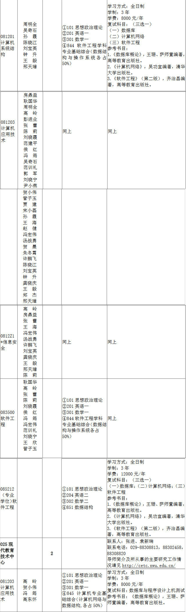
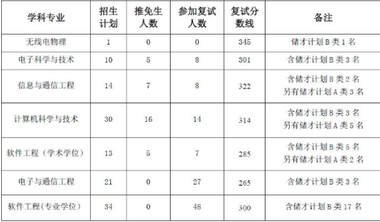

# 西北大学计算机考研报考资料、复试资料汇总 for 2020
>QQ交流群: 981055625

## 目录
* [初试篇](#初试篇)
   * [西北大学考研重要网站](#西北大学考研重要网站)
   * [招生专业目录](#招生专业目录)
       * [1. 信息科学与技术学院招生目录](#1-信息科学与技术学院招生目录)
    * [考试大纲](#考试大纲)
       * [1. 844软件工程学科专业基础综合](#1-844软件工程学科专业基础综合)
       * [2. 851数据结构](#2-851数据结构)
* [复试篇](#复试篇)
   * [分数线](#分数线)
       * [1. 分数线简介](#1-分数线简介)
       * [2. 国家线](#2-国家线)
            * [2.1 2017年国家线](#21-2017年国家线)
            * [2.2 2018年国家线](#22-2018年国家线)
            * [2.3 2019年国家线](#23-2019年国家线)
       * [3. 院线](#3-院线)
            * [3.1 信息科学与技术学院院线](#31-信息科学与技术学院院线)
   * [复试进行时](#复试进行时)
       * [1. 复试细则](#1-复试细则)
            * [1.1 信息科学与技术学院复试细则](#11-信息科学与技术学院复试细则)
       * [2. 复试名单](#2-复试名单)
            * [2.1 信息科学与技术学院复试名单](#21-信息科学与技术学院复试名单)
       * [3. 复试科目](#3-复试科目)
            * [3.1 信息科学与技术学院复试科目](#31-信息科学与技术学院复试科目)
       * [4. 导师资料](#4-导师资料)
       * [5. 王道经验贴](#5-王道经验贴)

## 初试篇
### 西北大学考研重要网站
- [王道论坛](http://www.cskaoyan.com/forum.php?mod=forumdisplay&fid=291&filter=typeid&typeid=43)
- [西北大学研招网](http://yzb.nwu.edu.cn)
- [信息科学与技术学院](http://ist.nwu.edu.cn)

### 招生专业目录
#### 1. 信息科学与技术学院招生目录

### 考试大纲
#### 1. 844软件工程学科专业基础综合
* 数据结构(50%)
* 操作系统(50%)
- 参考书目:
* 《数据结构————用C语言描述》,狄国华,高等教育出版社
* 《操作系统：精髓与设计原理》（原书第六版）,美Willianm Stallings著,陈向群等译,机械工业出版社

#### 2. 851数据结构
- 参考书目:
* 《数据结构————C语言描述》,狄国华,高等教育出版社

## 复试篇
### 分数线
#### 1. 分数线简介

#### 2. 国家线
##### 2.1 2017年国家线
[2017年国家线](https://yz.chsi.com.cn/kyzx/kydt/201703/20170315/1591016940.html)

##### 2.2 2018年国家线
[2018年国家线学术学位](https://yz.chsi.com.cn/kyzx/kp/201803/20180316/1670298651.html)

[2018年国家线专业学位](https://yz.chsi.com.cn/kyzx/kp/201803/20180316/1670298653.html)

##### 2.3 2019年国家线
[2019年国家线学术学位](https://yz.chsi.com.cn/kyzx/kp/201903/20190315/1772265280.html)

[2019年国家线专业学位](https://yz.chsi.com.cn/kyzx/kp/201903/20190315/1772265285.html)

#### 3. 院线
##### 3.1 信息科学与技术学院院线

### 复试进行时
#### 1 复试细则
##### 1.1 信息科学与技术学院复试细则
[信息科学与技术学院复试细则](http://ist.nwu.edu.cn/upload/appendix/149/2019-03-27_5c9aecb0e0a0e.pdf)

#### 2 复试名单
##### 2.1 信息科学与技术学院复试名单
[2019年复试名单](./西北大学/复试/2019年信息科学与技术学院硕士研究生复试工作方案.pdf)

#### 3 复试科目
##### 3.1 信息科学与技术学院复试科目

- 081201计算机系统结构
- 081203计算机应用技术
- 0812Z1信息安全
- 083500软件工程

笔试(三选一):
* 数据库
* 计算机网络
* 软件工程
- 参考书目:
* 《数据库概论》,王珊、萨师煊编著,高等教育出版社
* 《计算机网络》,吴功宜编著,清华大学出版社
* 《软件工程》（第二版），齐治昌编著,高等教育出版社

面试：
* 综合面试
* 英语听说

#### 4 导师资料
* [信息科学与技术学院](http://ist.nwu.edu.cn/home/index/articles/mid/5357.html)

#### 5 王道经验贴
* [西北大学软件工程2018回忆](http://www.cskaoyan.com/forum.php?mod=viewthread&tid=649853&fromuid=484376)
* [西北大学2018年计科软工考研总结交流](http://www.cskaoyan.com/forum.php?mod=viewthread&tid=649869&fromuid=484376)