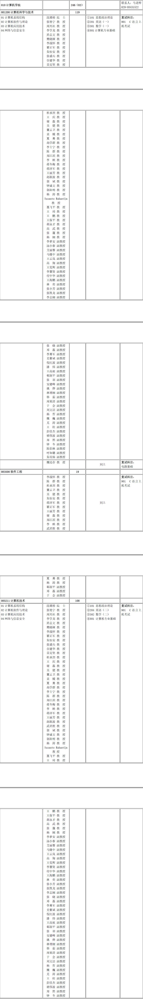
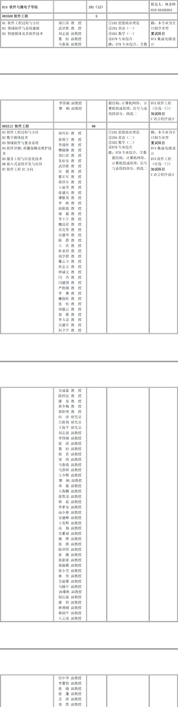

# 西北工业大学计算机考研报考资料、复试资料汇总 for 2020
>QQ交流群: 459473963

## 目录
* [初试篇](#初试篇)
   * [西工大考研重要网站](#西工大考研重要网站)
   * [招生专业目录](#招生专业目录)
       * [1. 计算机学院招生目录](#1-计算机学院招生目录)
       * [2. 软件学院招生目录](#2-软件学院招生目录)
    * [考试大纲](#考试大纲)
       * [1. 801计算机专业基础](#1-801计算机专业基础)
       * [2. 825通信原理](#2-825通信原理)
       * [3. 847计算机原理及网络](#3-847计算机原理及网络)
       * [4. 858信号检测与估计](#4-858信号检测与估计)
       * [5. 879专业综合](#5-879专业综合)
* [复试篇](#复试篇)
   * [分数线](#分数线)
       * [1. 分数线简介](#1-分数线简介)
       * [2. 国家线](#2-国家线)
            * [2.1 2017年国家线](#21-2017年国家线)
            * [2.2 2018年国家线](#22-2018年国家线)
            * [2.3 2019年国家线](#23-2019年国家线)
       * [3. 院线](#3-院线)
            * [3.1 计算机学院院线](#31-计算机学院院线)
            * [3.2 软件学院院线](#32-软件学院院线)
   * [复试进行时](#复试进行时)
       * [1. 复试细则](#1-复试细则)
            * [1.1 计算机学院复试细则](#11-计算机学院复试细则)
            * [1.2 软件学院复试细则](#12-软件学院复试细则)
       * [2. 复试名单](#2-复试名单)
            * [2.1 计算机学院复试名单](#21-计算机学院复试名单)
            * [2.2 软件学院复试名单](#22-软件学院复试名单)
       * [3. 复试科目](#3-复试科目)
            * [3.1 计算机学院复试科目](#31-计算机学院复试科目)
            * [3.2 软件学院复试科目](#32-软件学院复试科目)
       * [4. 导师资料](#4-导师资料)
       * [5. 王道经验贴](#5-王道经验贴)

## 初试篇
### 西工大考研重要网站
- [王道论坛](http://www.cskaoyan.com/forum-109-1.html)
- [西北工业大学研招网](http://yzb.nwpu.edu.cn)
- [计算机学院](http://jsj.nwpu.edu.cn/)
- [软件学院](http://rjwdz.nwpu.edu.cn/)

### 招生专业目录
#### 1. 计算机学院招生目录

#### 2. 软件学院招生目录

### 考试大纲
#### 1. 801计算机专业基础
[801大纲](./西北工业大学/初试/801大纲.docx)

#### 2. 825通信原理
[825通信原理](./西北工业大学/初试/825大纲.docx)

#### 3. 847计算机原理及网络
[847计算机原理及网络](./西北工业大学/初试/847大纲.docx)

#### 4. 858信号检测与估计
[858信号检测与估计](./西北工业大学/初试/858大纲.docx)

#### 5. 879专业综合
[879专业综合](./西北工业大学/初试/879大纲.docx)

## 复试篇
### 分数线
#### 1. 分数线简介

#### 2. 国家线
##### 2.1 2017年国家线
[2017年国家线](https://yz.chsi.com.cn/kyzx/kydt/201703/20170315/1591016940.html)

##### 2.2 2018年国家线
[2018年国家线学术学位](https://yz.chsi.com.cn/kyzx/kp/201803/20180316/1670298651.html)

[2018年国家线专业学位](https://yz.chsi.com.cn/kyzx/kp/201803/20180316/1670298653.html)

##### 2.3 2019年国家线
[2019年国家线学术学位](https://yz.chsi.com.cn/kyzx/kp/201903/20190315/1772265280.html)

[2019年国家线专业学位](https://yz.chsi.com.cn/kyzx/kp/201903/20190315/1772265285.html)

#### 3. 院线
##### 3.1 计算机学院院线
见复试细则

##### 3.2 软件学院院线
见复试细则

### 复试进行时
#### 1 复试细则
##### 1.1 计算机学院复试细则
[计算机学院复试细则](./西北工业大学/复试/计算机学院硕士研究生复试工作方案.doc)

##### 1.2 软件学院复试细则
[软件学院复试细则](./西北工业大学/复试/软件与微电子学院2019年研究生复试方案.doc)

#### 2 复试名单
##### 2.1 计算机科学与技术学院复试名单

##### 2.2 软件学院复试名单

#### 3 复试科目
##### 3.1 计算机科学与技术学院复试科目

* C语言上机考试
* 英语翻译
* 面试

##### 3.2 软件学院复试科目
* 软件工程集成电路2选一
* C语言上机考试（跨考必参加）
* 外语水平测试
* 面试

#### 4 导师资料
* [计算机学院](http://jsj.nwpu.edu.cn)
* [软件学院](http://rjwdz.nwpu.edu.cn)

#### 5 王道经验贴
[西北工业大学考研经验贴集合](http://www.cskaoyan.com/thread-655074-1-1.html)