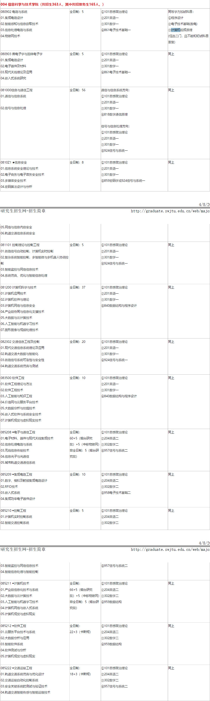
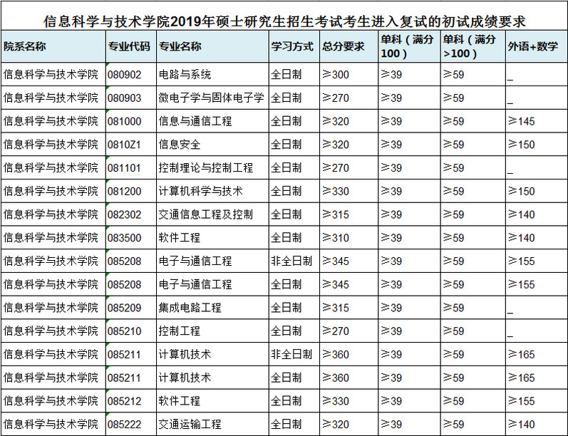
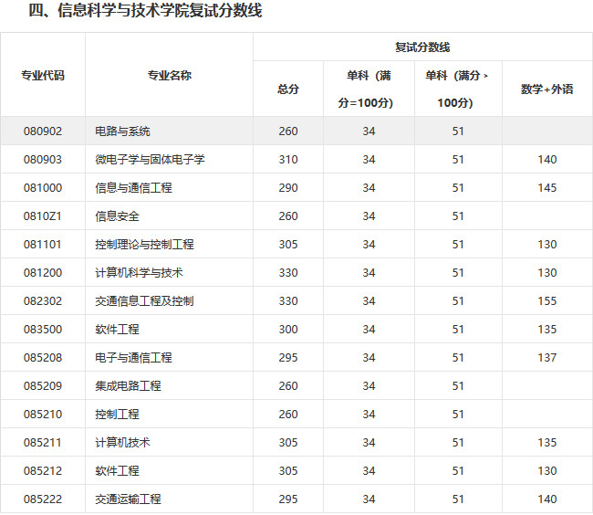
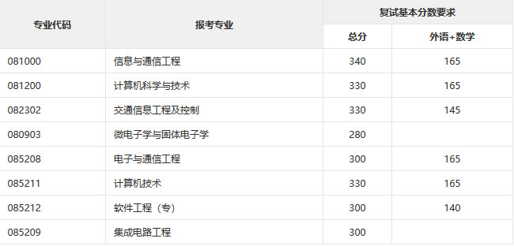

# 西南交通大学计算机考研报考资料、复试资料汇总 for 2020
>QQ交流群: 959201229

## 目录
* [初试篇](#初试篇)
   * [西南交通大学考研重要网站](#西南交通大学考研重要网站)
   * [招生专业目录](#招生专业目录)
       * [1. 信息科学与技术学院招生目录](#1-信息科学与技术学院招生目录)
    * [考试大纲](#考试大纲)
       * [1. 859密码学](#1-859密码学)
       * [2. 924信号与系统一](#2-924信号与系统一)
       * [3. 840数据结构与程序设计](#3-840数据结构与程序设计)
       * [4. 959数据结构](#4-959数据结构)
* [复试篇](#复试篇)
   * [分数线](#分数线)
       * [1. 分数线简介](#1-分数线简介)
       * [2. 国家线](#2-国家线)
            * [2.1 2017年国家线](#21-2017年国家线)
            * [2.2 2018年国家线](#22-2018年国家线)
            * [2.3 2019年国家线](#23-2019年国家线)
       * [3. 院线](#3-院线)
            * [3.1 信息科学与技术学院院线](#31-信息科学与技术学院院线)
   * [复试进行时](#复试进行时)
       * [1. 复试细则](#1-复试细则)
            * [1.1 信息科学与技术学院复试细则](#11-信息科学与技术学院复试细则)
       * [2. 复试名单](#2-复试名单)
            * [2.1 信息科学与技术学院复试名单](#21-信息科学与技术学院复试名单)
       * [3. 复试科目](#3-复试科目)
            * [3.1 信息科学与技术学院复试科目](#31-信息科学与技术学院复试科目)
       * [4. 导师资料](#4-导师资料)
       * [5. 王道经验贴](#5-王道经验贴)
       * [6. 拟录取名单](#6-拟录取名单)

## 初试篇
### 西南交通大学考研重要网站
- [王道论坛](http://www.cskaoyan.com/forum.php?mod=forumdisplay&fid=323&filter=typeid&typeid=41)
- [西南交通大学研招网](http://graduate.swjtu.edu.cn)
- [信息科学与技术学院](http://sist.swjtu.edu.cn)

### 招生专业目录
#### 1. 信息科学与技术学院招生目录

### 考试大纲
#### 1. 859密码学
- 参考书目:
《现代密码学》何大可等编,人民邮电出版社,第1版

#### 2. 924信号与系统一
- 参考书目:
《信号与系统》(SIGNALS   &SYSTEMS)第二版(second Edition),刘树棠译(ALANV.OPPENHEIM)西安交通大学出版社(/SBN7-5605-0970-3/TN.53) 

#### 3. 840数据结构与程序设计
- 参考书目:
* 《数据结构》(C语言版)严蔚敏，吴伟民编，清华大学出版社
* 《C语言程序设计》宁爱军编，人民邮电出版社，第2版 
#### 4. 959数据结构
* 《数据结构》(C语言版)严蔚敏,吴伟民编,清华大学出版社

## 复试篇
### 分数线
#### 1. 分数线简介

#### 2. 国家线
##### 2.1 2017年国家线
[2017年国家线](https://yz.chsi.com.cn/kyzx/kydt/201703/20170315/1591016940.html)

##### 2.2 2018年国家线
[2018年国家线学术学位](https://yz.chsi.com.cn/kyzx/kp/201803/20180316/1670298651.html)

[2018年国家线专业学位](https://yz.chsi.com.cn/kyzx/kp/201803/20180316/1670298653.html)

##### 2.3 2019年国家线
[2019年国家线学术学位](https://yz.chsi.com.cn/kyzx/kp/201903/20190315/1772265280.html)

[2019年国家线专业学位](https://yz.chsi.com.cn/kyzx/kp/201903/20190315/1772265285.html)

#### 3. 院线
##### 3.1 信息科学与技术学院院线
- 2019年复试线:

- 2018年复试线:

- 2017复试线:

### 复试进行时
#### 1 复试细则
##### 1.1 信息科学与技术学院复试细则
- [2019信息科学与技术学院复试细则](./西南交通大学/复试/2019信息科学与技术学院复试细则.pdf)

#### 2 复试名单
##### 2.1 信息科学与技术学院复试名单
- [2019复试名单](./西南交通大学/复试/信息学院2019年硕士研究生招生统考考生复试名单（公示名单）.pdf)

#### 3 复试科目
##### 3.1 信息科学与技术学院复试科目

- 笔试：
1. 微机与接口技术(40 分)
2. 数据库(30 分)
3. 计算机专业基础综合(30 分)
笔试侧重于考查基础知识和基本理论，考试时间2 小时。

- 实践（实验）能力考核：
报考我院各专业的考生均须参加计算机编程上机考试，主要考查考生运用C 语言（标准
C 语言）上机编程的能力。考试时间1 小时，满分100 分。

- 面试（口试）:
面试按专业分组进行（对于参加复试考生较多的专业，按初试成绩平行分组），主要考查
考生对本学科理论知识和应用技能的掌握程度，运用所学理论发现、分析和解决问题的能力，
对本学科发展动态的了解以及在本学科领域发展的潜力和创新能力。面试中要参考考生在高
校期间的学习成绩、科研活动或工作业绩，同时了解考生的思想道德表现和诚信记录。思想
品德考核不合格者，不得录取。此外，面试中还要考查考生的事业心、责任感、纪律性、协
作性和心理健康情况，了解考生的人文素养、举止、表达和礼仪等。
面试中还将进行外语听力、口语测试。
面试成绩满分为100 分。

#### 4 导师资料
* [信息科学与技术学院](http://sist.swjtu.edu.cn/teacher.do?action=teachers&navId=31)

#### 5 王道经验贴
* [2018西南交通大学计算机三本学哥考研路](http://www.cskaoyan.com/forum.php?mod=viewthread&tid=651371&fromuid=484376)
* [18成功考生给19考研双非跨考计算机学子的建议和经验分享](http://www.cskaoyan.com/forum.php?mod=viewthread&tid=651372&fromuid=484376)
* [19跨考西南交通计算机技术失败（附资料）](http://www.cskaoyan.com/forum.php?mod=viewthread&tid=654698&fromuid=484376)

#### 6 拟录取名单
* [2019拟录取名单](./西南交通大学/复试/2019年西南交通大学信息科学与技术学院硕士生招生拟录取名单(公示).pdf)