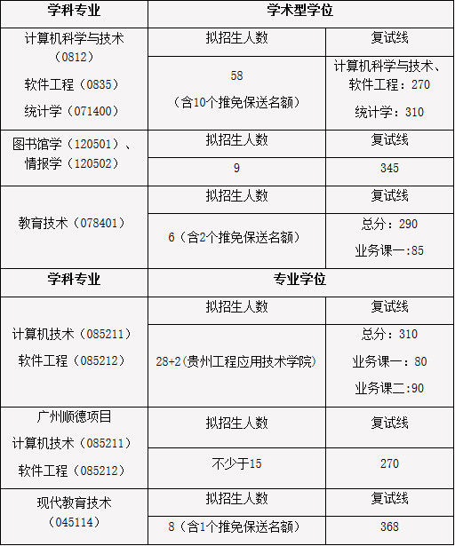
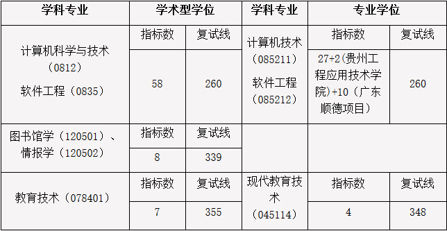

# 西南大学计算机考研报考资料、复试资料汇总 for 2020
>QQ交流群: 992025920

## 目录
* [初试篇](#初试篇)
   * [西南大学考研重要网站](#西南大学考研重要网站)
   * [招生专业目录](#招生专业目录)
       * [1. 计算机与信息科学学院、软件学院招生目录](#1-计算机与信息科学学院、软件学院招生目录)
    * [考试大纲](#考试大纲)
       * [1. 808计算机专业基础综合](#1-808计算机专业基础综合)
       * [2. 919工程综合](#2-919工程综合)
* [复试篇](#复试篇)
   * [分数线](#分数线)
       * [1. 分数线简介](#1-分数线简介)
       * [2. 国家线](#2-国家线)
            * [2.1 2017年国家线](#21-2017年国家线)
            * [2.2 2018年国家线](#22-2018年国家线)
            * [2.3 2019年国家线](#23-2019年国家线)
       * [3. 院线](#3-院线)
            * [3.1 计算机与信息科学学院、软件学院院线](#31-计算机与信息科学学院、软件学院院线)
   * [复试进行时](#复试进行时)
       * [1. 复试细则](#1-复试细则)
            * [1.1 计算机与信息科学学院、软件学院复试细则](#11-计算机与信息科学学院、软件学院复试细则)
       * [2. 复试名单](#2-复试名单)
            * [2.1 计算机与信息科学学院、软件学院复试名单](#21-计算机与信息科学学院、软件学院复试名单)
       * [3. 复试科目](#3-复试科目)
            * [3.1 计算机与信息科学学院、软件学院复试科目](#31-计算机与信息科学学院、软件学院复试科目)
       * [4. 导师资料](#4-导师资料)
       * [5. 王道经验贴](#5-王道经验贴)
       * [6. 调剂信息](#6-调剂信息)

## 初试篇
### 西南大学考研重要网站
- [王道论坛](http://www.cskaoyan.com/forum.php?mod=forumdisplay&fid=323&filter=typeid&typeid=40)
- [西南大学研招网](http://yz.swu.edu.cn)
- [计算机与信息科学学院、软件学院](http://computer.swu.edu.cn/)

### 招生专业目录
#### 1. 计算机与信息科学学院、软件学院招生目录

### 考试大纲
#### 1. 808计算机专业基础综合
主要涉及操作系统与数据结构的相关内容。数据结构：考核要点主要包括数据、数据结构和抽象数据类型等基本概念；线性表、栈、队列、串、数组、广义表、树和二叉树以及图等基本类型的数据结构及其应用；查找表和排序；初步的算法设计与分析能力。操作系统：课程要求考生比较系统地掌握操作系统的基本概念、基本原理和基本功能，理解操作系统的整体运行过程，掌握操作系统进程、内存、文件和I/O管理的策略、算法、机制以及相互关系。能够运用所学的操作系统原理、方法与技术分析问题和解决问题，并能利用C语言描述相关算法。

#### 2. 919工程综合
##### 1、工程综合：
涵盖工程制图基础和大学计算机基础两大部分内容。（总分150分，工程制图基础约50分，大学计算机基础约100分）

（1）大学计算机基础部分
* 1）.科学方法、信息素养、计算思维等跨学科范畴的通用性知识、计算学科在科学研究和知识创新中的重要性认识、计算机技术在问题求解中的重要性认识；了解科学机科学史以及计算机科技史对我们知识创新、科技创新、科学研究方法等方面的启发；
* 2）.信息表示与数据编码、计算机的软件硬件系统组成以及相应原理、数据存储与信息安全；操作系统的概念、组成、功能的理解、计算机系统安全与维护、结合Windows系统的使用，对进程、线程的理解以及控制面板理解；
* 3）.办公自动化软件在科学研究中的作用，包括论文编排的方法和技巧以及邮件合并；电子表格在数据的管理、统计分析应用；主题PPT的制作方法与技巧；
* 4）.了解多媒体技术、流媒体、图像、音频、视频处理技术以及相应软件在科研素材处理中的应用；
* 5）.计算机网络的概念、功能以及发展史；TCP/IP模型与网络协议；网络硬件与设备和络传输介质网络中的计算机配置；网络共享的设置；互联网的发展历史、主要服务以及思想；网络常见故障以及维护；物联网有关的概念和主要技术、互联网+以及万物互联与网络经济和数字经济的联系等；
* 6）.计算机程序的概念、编程思想、开发方法；结构化程序设计与面向对象程序设计的主要思想；掌握C语言程序设计的知识体系、能够熟练阅读C语言程序和利用C语言编写处理常见问题（如求和、求积、判断素数、排序、查找等问题）、能够在开发环境中熟练调试程序。
* 7）.能够追踪和理解新技术、新科技的思想和方法，并将其应用于现实世界创新性解决一些实际问题。 
 
 (2)“工程制图基础”部分参考书：
杨君伟.机械识图.机械工业出版社， 2009年，第1版 （参考第1、2章即可）
(丛书名: 国家职业资格培训教材 ，ISBN: 9787111265566 )

## 复试篇
### 分数线
#### 1. 分数线简介

#### 2. 国家线
##### 2.1 2017年国家线
[2017年国家线](https://yz.chsi.com.cn/kyzx/kydt/201703/20170315/1591016940.html)

##### 2.2 2018年国家线
[2018年国家线学术学位](https://yz.chsi.com.cn/kyzx/kp/201803/20180316/1670298651.html)

[2018年国家线专业学位](https://yz.chsi.com.cn/kyzx/kp/201803/20180316/1670298653.html)

##### 2.3 2019年国家线
[2019年国家线学术学位](https://yz.chsi.com.cn/kyzx/kp/201903/20190315/1772265280.html)

[2019年国家线专业学位](https://yz.chsi.com.cn/kyzx/kp/201903/20190315/1772265285.html)

#### 3. 院线
##### 3.1 计算机与信息科学学院、软件学院院线

2019年复试线:

2018年复试线:

### 复试进行时
#### 1 复试细则
##### 1.1 计算机与信息技术学院、软件学院复试细则
- [2019计算机与信息科学学院复试细则](./西南大学/复试/2019计算机与信息科学学院复试细则.pdf)

- [2018计算机与信息科学学院复试细则](./西南大学/复试/2018计算机与信息科学学院复试细则.pdf)

#### 2 复试名单
##### 2.1 计算机与信息技术学院、软件学院复试名单
- [2019复试名单](./西南大学/复试/2019复试名单.pdf)
- [2019调剂复试名单](./西南大学/复试/2019调剂复试名单.pdf)

#### 3 复试科目
##### 3.1 计算机与信息技术学院、软件学院复试科目

本学院复试采用面试形式，内容包含以下几个方面：

1) 专业素质和能力（占复试总成绩的70%）

内容包括：

(1) 大学阶段学习情况及成绩；

(2) 全面考核考生对本学科（专业）理论知识和应用技能掌握程度，利用所学理论发现、分析和解决问题的能力，对本学科发展动态的了解以及在本专业领域发展的潜力；

(3) 创新精神和创新能力。

2) 外语听力、口语测试（占复试总成绩的10%）；

3)综合素质和能力（占复试总成绩的20%）

内容包括：思想政治素质、道德品质和心理测评等；本学科（专业）以外的学习、科研、社会实践（学生工作、社团活动、志愿服务等）或实际工作表现等方面的情况；事业心、责任感、纪律性、协作性和心理健康情况；人文素养；举止、表达和礼仪等。

4）思政及心理测评组织形式：专门成立以学院负责学生工作的党委副书记为组长，熟悉学生工作的辅导员为成员的思政及心理测评小组。满分为100分，大于等于60分为合格。该项成绩不记入总分，但不合格者不予录取。

#### 4 导师资料
* [计算机与信息技术学院、软件学院](http://computer.swu.edu.cn/szdw2szdw/20160428/915455.html)

#### 5 王道经验贴
* [2018年西南大学学硕考研经验分享](http://www.cskaoyan.com/forum.php?mod=viewthread&tid=649894&fromuid=484376)
* [2018西南大学计算机考研复试经验贴](http://www.cskaoyan.com/forum.php?mod=viewthread&tid=643340&fromuid=484376)
* [2018西南大学专业课808复习经验](http://www.cskaoyan.com/forum.php?mod=viewthread&tid=649977&fromuid=484376)
* [2017西南大学计算机考研经验贴](http://www.cskaoyan.com/forum.php?mod=viewthread&tid=642740&fromuid=484376)

#### 6 调剂信息
* [2019年计算机与信息科学学院硕士研究生招生调剂实施细则](./西南大学/复试/计算机与信息科学学院2019年硕士研究生招生调剂实施细则.pdf)
* [2017年关于填报调剂意向采集服务系统的通知](http://computer.swu.edu.cn/s/computer/zsjy2yjszs/20170310/1727080.html)