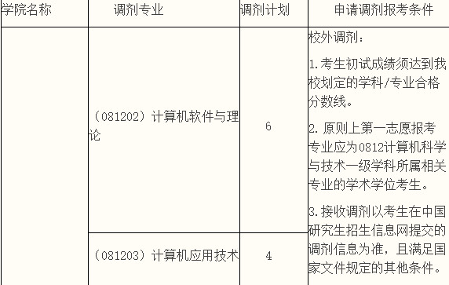

# 西南财经大学计算机考研报考资料、复试资料汇总 for 2020
>QQ交流群: 884060147

## 目录
* [初试篇](#初试篇)
   * [西南财经大学考研重要网站](#西南财经大学考研重要网站)
   * [招生专业目录](#招生专业目录)
       * [1. 经济信息工程学院招生目录](#1-经济信息工程学院招生目录)
    * [考试大纲](#考试大纲)
       * [1. 408计算机专业基础综合](#1-408计算机专业基础综合)
* [复试篇](#复试篇)
   * [分数线](#分数线)
       * [1. 分数线简介](#1-分数线简介)
       * [2. 国家线](#2-国家线)
            * [2.1 2017年国家线](#21-2017年国家线)
            * [2.2 2018年国家线](#22-2018年国家线)
            * [2.3 2019年国家线](#23-2019年国家线)
       * [3. 院线](#3-院线)
            * [3.1 经济信息工程学院院线](#31-经济信息工程学院院线)
   * [复试进行时](#复试进行时)
       * [1. 复试细则](#1-复试细则)
            * [1.1 经济信息工程学院复试细则](#11-经济信息工程学院复试细则)
       * [2. 复试名单](#2-复试名单)
            * [2.1 经济信息工程学院复试名单](#21-经济信息工程学院复试名单)
       * [3. 复试科目](#3-复试科目)
            * [3.1 经济信息工程学院复试科目](#31-经济信息工程学院复试科目)
       * [4. 导师资料](#4-导师资料)
       * [5. 王道经验贴](#5-王道经验贴)
       * [6. 调剂信息](#6-调剂信息)

## 初试篇
### 西南财经大学考研重要网站
- [王道论坛](http://cskaoyan.com/forum.php?mod=forumdisplay&fid=273&filter=typeid&typeid=45)
- [西南财经大学研招网](http://yz.swufe.edu.cn)
- [经济信息工程学院](https://it.swufe.edu.cn/)

### 招生专业目录
#### 1. 经济信息工程学院招生目录
[2019年招生目录](./西南大学/初试/计算机与信息科学学院2019年硕士研究生招生目录.doc)

### 考试大纲
#### 1. 408计算机专业基础综合
* 数据结构45分
* 计算机组成原理45分
* 操作系统35分
* 计算机网络25分

## 复试篇
### 分数线
#### 1. 分数线简介

#### 2. 国家线
##### 2.1 2017年国家线
[2017年国家线](https://yz.chsi.com.cn/kyzx/kydt/201703/20170315/1591016940.html)

##### 2.2 2018年国家线
[2018年国家线学术学位](https://yz.chsi.com.cn/kyzx/kp/201803/20180316/1670298651.html)

[2018年国家线专业学位](https://yz.chsi.com.cn/kyzx/kp/201803/20180316/1670298653.html)

##### 2.3 2019年国家线
[2019年国家线学术学位](https://yz.chsi.com.cn/kyzx/kp/201903/20190315/1772265280.html)

[2019年国家线专业学位](https://yz.chsi.com.cn/kyzx/kp/201903/20190315/1772265285.html)

#### 3. 院线
##### 3.1 经济信息工程学院院线
* 2018年硕士研究生复试线
工学  260  34  51

* 2017年硕士研究生复试线
工学  265  35  53

* 2016年硕士研究生复试线
工学  265  36  54

### 复试进行时
#### 1 复试细则
##### 1.1 经济信息工程学院复试细则
* [2019经济信息工程学院复试细则](./西南财经大学/复试/2019年硕士研究生入学考试复试录取工作细则.pdf)

#### 2 复试名单
##### 2.1 经济信息工程学院复试名单

#### 3 复试科目
##### 3.1 经济信息工程学院复试科目
笔试：
程序设计C语言

面试：
1. 外语考查考生的外语听说能力，且测试的内容涵盖公共英语和专业知识
2. 学生抽题回答和面试评审教师提问相结合，每个考生抽题回答不少于2个问题且面试时间不得少于15分钟。每位考生面试结束后，由参加面试的专业课教师当场独立打分，其平均分为考生的专业面试成绩

#### 4 导师资料
* [经济信息工程学院](https://it.swufe.edu.cn/szdw/jsbd.htm)

#### 5 王道经验贴
* [2019西南财经大学计算机考研调剂经验分享帖](http://cskaoyan.com/forum.php?mod=viewthread&tid=654531&fromuid=484376)

#### 6 调剂信息
